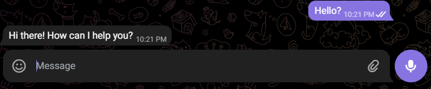
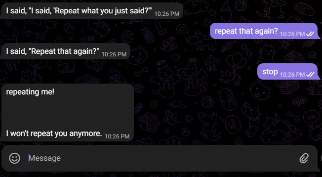

# Telegram chatbot with openAI GPT-3


## Hello?


## Keep track of context?



## Getting started

### Prerequisites

- Python 3.6+
- Telegram Bot API token
- OpenAI API key

### Installation

```bash
git clone https://github.com/darklight147/telegram-gpt-bot.git
cd telegram-gpt-bot
pip install -r requirements.txt
```

### Configuration

```bash
cp .env.example .env
```

Edit `.env` file and fill in your Telegram Bot API token and OpenAI API key.

### Run

```bash
python main.py

# or python3 main.py
```
### Or run with Docker

```bash
docker build -t telegram-gpt-bot .
docker run -d --name telegram-gpt-bot telegram-gpt-bot
```
